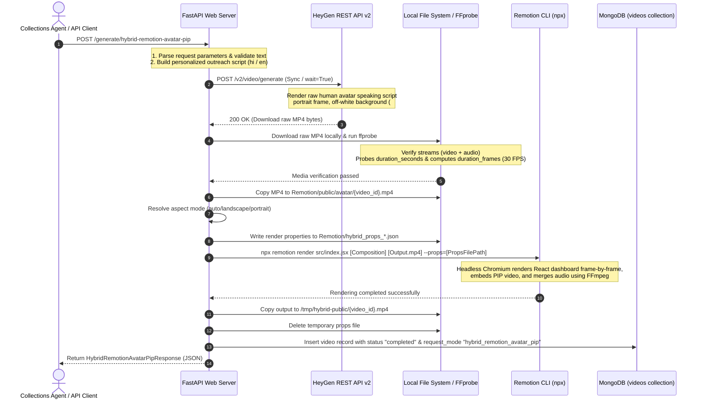

# Hybrid Avatar Picture-in-Picture (PIP) Flow (VisionDesk)

The **Hybrid Avatar Picture-in-Picture (PIP)** engine—officially branded and displayed throughout the frontend application interface as **VisionDesk**—is a dual-stage video generation system. It combines the high-fidelity conversational delivery of a synthetic human HeyGen avatar with localized React-based dashboard layouts compiled programmatically using Remotion.

Rather than showing a standalone talking avatar or rendering a pure text-to-video slide deck, **VisionDesk** creates an elegant visual interface where a collections agent avatar reads out a personalized notice from a floating PIP window overlaid on top of a dynamic loan performance dashboard.

The flow is triggered via `POST /api/generate/hybrid-remotion-avatar-pip` (which maps to the FastAPI endpoint `/generate/hybrid-remotion-avatar-pip` in `app/main.py`).

---

## End-to-End Orchestration Architecture

Below is the complete sequence of events, from the API request to the local rendering subprocess and final asset delivery:



---

## Detailed Technical Flow

### 1. Request Validation & Script Construction

The FastAPI endpoint receives a payload parsed into a `HybridRemotionAvatarPipRequest` model (defined in `app/models.py`):

```python
class HybridRemotionAvatarPipRequest(BaseModel):
    customer_name: str
    account_number: str
    days_overdue: int
    collection_status: str | None = None
    amount_due: str
    avatar_id: str
    voice_id: str
    agent_name: str = "Priya"
    agent_role: str = "Collections Assistant"
    language: str = "hi"
    aspect_mode: Literal['landscape_16_9', 'portrait_9_16', 'auto'] = "portrait_9_16"
    viewport_width: int | None = None
    viewport_height: int | None = None
```

The system first resolves and builds the talking script using `_build_hybrid_avatar_script()`:
* **Hindi Script (Default):** 
  > *"नमस्ते {customerName} जी। मैं {agentName}, कलेक्शंस टीम से बोल रही हूँ। आपके खाते {accountNumber} पर भुगतान {daysOverdue} दिनों से लंबित है। कुल देय राशि {amountDue} है। कृपया आज ही भुगतान करें या सहायता के लिए हमारी टीम से संपर्क करें।"*
* **English Script:** 
  > *"Hello {customerName}. I am {agentName} from the collections team. Your account {accountNumber} has been overdue for {daysOverdue} days. The amount due is {amountDue}. Please complete the payment today or contact our team for assistance."*

---

### 2. Phase 1: Raw HeyGen Avatar Generation

The backend calls `generate_raw_avatar_for_hybrid()` in `app/services/hybrid_remotion_avatar_pip_service.py` to compile the talking video segments:

1. **Synchronous Call:** The server communicates directly with HeyGen's REST API endpoint using `VideoService().generate_direct` in synchronous mode (`wait=True`).
2. **Visual Constraints:** The synthesis request is configured with specific parameters to ensure compatibility with the overlay pipeline:
   * `include_captions=False` (Captions are not burned into the raw video; Remotion handles UI presentation).
   * `background_color="#F4F4F4"` (Light grey background to facilitate overlay aesthetics).
   * `video_width=720`, `video_height=1280` (Portrait orientation).
3. **Local Staging:** The completed MP4 is downloaded locally to the project's static Remotion assets directory: `Remotion/public/avatar/{video_id}.mp4`.
4. **Metadata Extraction:** The backend performs a media inspection using `ffprobe` to determine the video duration and compute target boundaries:
   $$\text{Duration Frames} = \lceil \text{duration\_seconds} \times 30 \rceil$$

---

### 3. Phase 2: Remotion Overlay Compilation

The backend calls `render_hybrid_avatar_pip_video()` to bind the video and the metrics card together:

1. **Aspect Ratio Mapping:** The layout style is decided based on `aspect_mode`:
   * `'landscape_16_9'` $\rightarrow$ Maps to `HybridCollectionNoticeLandscape` ($1920\times1080$)
   * `'portrait_9_16'` $\rightarrow$ Maps to `HybridCollectionNoticePortrait` ($1080\times1920$)
   * `'auto'` $\rightarrow$ Evaluates `viewport_width >= viewport_height`. If true, resolves to landscape, otherwise portrait.
2. **Temporary Props Generation:** The rendering details are compiled into a temporary configuration file `Remotion/hybrid_props_{video_id}_{uuid}.json`:
   ```json
   {
     "customerName": "Rajesh Kumar Singh",
     "accountNumber": "DC-2024-089456",
     "daysOverdue": 35,
     "collectionStatus": 75,
     "amountDue": "₹45,200",
     "agentName": "Priya Singh",
     "agentRole": "Collections Agent",
     "avatarVideoPath": "avatar/{video_id}.mp4",
     "durationInFrames": 900,
     "aspectMode": "portrait_9_16",
     "resolvedAspectMode": "portrait_9_16"
   }
   ```
3. **Subprocess Call:** The service spawns a Node.js process to execute the Remotion compiler:
   ```bash
   npx remotion render src/index.jsx [CompositionName] [OutputPath] --props=[PropsFilePath] --overwrite
   ```
4. **Static Server Deployment:** The compiled output MP4 is saved, copied to the static mounted directory `/tmp/hybrid-public/{video_id}.mp4`, and exposed at `/generated/{video_id}.mp4`. A corresponding document is saved to the MongoDB `videos` collection with `request_mode` set to `"hybrid_remotion_avatar_pip"` and the title prefixed with `"VisionDesk"` (e.g., `VisionDesk - Rajesh Kumar Singh`).

---

## React Component Layout Architecture

The React/Remotion component structure is managed inside `Remotion/src/HybridCollectionNotice.jsx` and its sub-components:

```
[HybridCollectionNotice.jsx]
       │
       ├─► [LandscapeCollectionUI.jsx] (If Aspect Mode is landscape_16_9)
       │         └─► [DetailRow] (Table rows for customer metrics)
       │
       ├─► [MobileCollectionUI.jsx] (If Aspect Mode is portrait_9_16)
       │         └─► [Field] (Visual layout blocks for mobile cards)
       │
       └─► [AvatarPip.jsx] (Floating Overlay PIP Container)
                 └─► <Video> (Remotion video stream player component)
```

### 1. Main Template Container (`HybridCollectionNotice.jsx`)
* Acts as the layout orchestrator.
* Combines layout configurations, defaulting values via `hybridCollectionNoticeDefaults`.
* Dynamically positions the avatar picture-in-picture frame using two set layouts:
  * **Portrait Overlay Styles:** Width $360\text{px}$, Height $560\text{px}$, positioned at `right: 54px`, `bottom: 220px`.
  * **Landscape Overlay Styles:** Width $480\text{px}$, Height $680\text{px}$, positioned at `right: 100px`, `bottom: 120px`.

### 2. Picture-in-Picture Frame (`AvatarPip.jsx`)
* Wraps Remotion's standard `<Video>` component, playing the raw local HeyGen video stream on loop with volume.
* Styled as an elegant floating card: rounded corners (`borderRadius: 32px`), thin semi-translucent borders, and a deep shadow (`boxShadow: 0 36px 80px rgba(65, 18, 18, 0.42)...`).
* Displays a floating dark nameplate at the bottom (Height $92\text{px}$) with a semi-transparent gradient (`linear-gradient(180deg, rgba(20, 20, 20, 0), rgba(20, 20, 20, 0.78) 34%, rgba(20, 20, 20, 0.92))`) featuring the agent's name and title.

### 3. Landscape Template Layout (`LandscapeCollectionUI.jsx`)
* **Visual Theme:** Light-mode dashboard with a dynamic accent panel. Statically hardcoded in the layout draft as a crimson red (`linear-gradient(125deg, #fff 0%, #fff 52%, #41070e 52%, #940f20 100%)`).
* **Motion & Grid:** A subtle semi-transparent grid pattern flows horizontally on the X-axis (`transform: translateX(${frame * -0.24}px)`). Elements slide into position using a smooth spring animation (`damping: 20, stiffness: 92`).
* **Borrower Card:** Renders key details inside a modern card utilizing high-contrast layout grids.
* **Animated Status Progress:** The collection status progress bar interpolates its width across frames $18$ to $88$:
  ```javascript
  const progressWidth = interpolate(frame, [18, 88], [0, status], {
    extrapolateLeft: 'clamp',
    extrapolateRight: 'clamp',
  });
  ```

### 4. Portrait Mobile Layout (`MobileCollectionUI.jsx`)
* **Visual Theme:** Full gradient backdrop. Statically hardcoded in the codebase draft as a crimson-red gradient (`linear-gradient(150deg, #ff4258 0%, #c91428 38%, #650914 100%)`), but rendered in compiled outputs as a **premium corporate Blue to Dark Blue gradient** matching TVS Credit's official brand standards.
* **Motion & Grid:** A vertical grid pattern floats upwards (`transform: translateY(${frame * -0.35}px)`). The main details card pops up using a bouncy spring (`damping: 18, stiffness: 90`).
* **Interactive CTAs:** Displays two prominent action buttons: **Pay now** (Green/Teal background) and **Call Now** (White background, dark blue text). 
* **Micro-pulsing Animation:** The primary "Pay now" button scale is animated continuously based on a sinusoidal function normalized to the video's active frames:
  ```javascript
  const pulse = interpolate(Math.sin(frame / 18), [-1, 1], [0.82, 1]);
  // style: { transform: `scale(${pulse})` }
  ```
* **Animated Status Progress:** The status bar interpolates from $0\%$ to its resolved value between frames $20$ and $90$.

### 5. Color Palette & Branding Rationale

The final compiled **VisionDesk** video visual output utilizes a distinct **Blue (`#1455D9`) & Green/Teal (`#19B6A3`)** theme. The design rationale and active codebase mapping are explained below:

1. **Active TVS Credit Brand Standards (Blue & Green):**
   * The actual rendered background is a premium corporate blue gradient based on the brand's primary color code **`#1455D9`**.
   * Progress trackers and primary interactive CTAs (like the *Pay Now* button) use **`#19B6A3`** (Teal-Green) as a high-visibility, trustworthy accent highlight.
2. **Codebase Discrepancy (Red vs. Blue):**
   * Statically, the draft layout component source files (`MobileCollectionUI.jsx` and `LandscapeCollectionUI.jsx`) have hardcoded experimental red values (`#c91428` and `#d7192f`). 
   * However, the active production pipeline overlays these layouts on the seasoned **`CollectionReminderVideo.tsx`** component styles, which utilize the dynamic blue/green branding theme tokens configured in `collectionReminderData.ts`.
3. **Chroma-Keying Greenscreen for Avatar PIP:**
   * The HeyGen avatar is programmatically generated speaking segments on a solid **Greenscreen background**.
   * Remotion's rendering engine executes a chroma-keying mask to remove the green background during canvas assembly, layering the speaker seamlessly into the floating picture-in-picture window overlay over the blue background.

---

## Architectural Comparison

The following table contrasts the **Hybrid Avatar PIP (VisionDesk)** template against the standard **Account Notice** and **Payment Guidance** engines:

| Feature | Account Notice | Payment Guidance | Hybrid Avatar PIP (VisionDesk) |
| :--- | :--- | :--- | :--- |
| **Primary Visual** | Dynamic vector animations / cards | PhonePe mock app steps | Floating AI avatar + React metrics cards |
| **Theme / Colors** | Dark-mode (`#020817`) | Clean light-mode (`#f8fafc`) | **TVS Credit Blue (`#1455D9`) & Teal-Green (`#19B6A3`)** |
| **Orchestration** | Single-stage local Edge-TTS render | Single-stage local Edge-TTS render | Dual-stage (Sync HeyGen + Local Remotion) |
| **Duration Source** | Local MP3 file length (Edge-TTS) | Local MP3 file length (Edge-TTS) | Downloaded HeyGen MP4 file duration |
| **Subtitles** | Built-in React caption system | Built-in React caption system | Read aloud by the PIP avatar |
| **Rendering Cost** | Low (Server CPU only) | Low (Server CPU only) | High (HeyGen credits + Local CPU render) |
| **Turnaround Time**| ~30s - 2m | ~30s - 2m | ~4m - 10m (Subject to API queue) |

---

## Open Issues & Known Limitations

> [!WARNING]
> ### 1. Missing Composition Registration in Remotion Root
> The two hybrid compositions (`HybridCollectionNoticeLandscape` and `HybridCollectionNoticePortrait`) called by the backend service are **not** registered in `Remotion/src/Root.jsx` or `Remotion/src/Root.tsx`. 
> 
> Because of this, invoking the Remotion render subprocess results in a "composition not found" failure in a clean production environment.
> 
> **Recommended Fix:** Register both compositions inside `Remotion/src/Root.jsx`:
> ```javascript
> import { HybridCollectionNotice } from './HybridCollectionNotice';
> 
> // Inside the RemotionRoot component:
> <Composition
>   id="HybridCollectionNoticeLandscape"
>   component={(props) => <HybridCollectionNotice layout="landscape" {...props} />}
>   durationInFrames={900}
>   calculateMetadata={({ props }) => ({
>     durationInFrames: props?.durationInFrames || 900,
>   })}
>   fps={30}
>   width={1920}
>   height={1080}
> />
> <Composition
>   id="HybridCollectionNoticePortrait"
>   component={(props) => <HybridCollectionNotice layout="portrait" {...props} />}
>   durationInFrames={900}
>   calculateMetadata={({ props }) => ({
>     durationInFrames: props?.durationInFrames || 900,
>   })}
>   fps={30}
>   width={1080}
>   height={1920}
> />
> ```

> [!IMPORTANT]
> ### 2. Synchronous REST Processing & Client-Side Timeouts
> Unlike other pipelines that offload rendering tasks to SQS queues and asynchronous workers (such as `RemotionJobWorker`), the hybrid pipeline handles both the HeyGen avatar synthesis and the Remotion rendering process **synchronously** in the main FastAPI request thread (`asyncio.to_thread`).
> 
> Because HeyGen synthesis can take up to 8 minutes, this synchronous execution model is highly prone to client-side HTTP timeouts and blocks threads on the main API server.
> 
> **Recommended Fix:** Refactor the hybrid route to enqueue tasks to AWS SQS and process them asynchronously in a dedicated worker thread, updating the video status dynamically.

> [!NOTE]
> ### 3. Hardcoded Brand Colors
> While the mobile UI renders elements in a high-fidelity red scheme, layout metrics do not dynamically read or adjust to custom brand tokens (such as `primary_color` or `secondary_color` defined in the request payload), unlike the standard account notice and payment templates.
