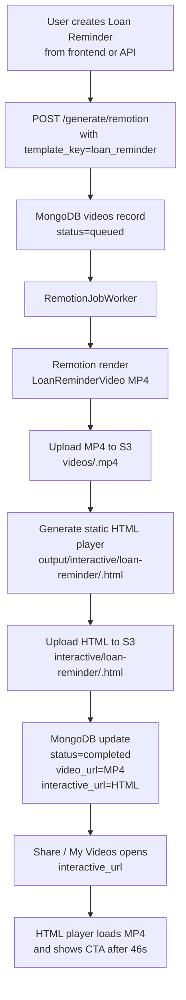

# Interactive Loan Reminder Flow

The Loan Reminder flow renders a normal Remotion MP4 and creates a separate
clickable HTML player page. The MP4 is never clickable. The clickable actions
come from real HTML links/buttons layered over the video.

## URL Model

Every completed `loan_reminder` job can have two customer-facing URLs:

| URL | Example | Purpose |
|---|---|---|
| `video_url` | `https://your-bucket.s3.amazonaws.com/videos/<id>.mp4` | Raw MP4 from S3. Visual video only. No clickable CTA. |
| `interactive_url` | `https://your-app-domain.com/interactive/loan-reminder/<id>.html` | S3-hosted HTML player with video plus clickable Pay Now and Call buttons. |

The share link for customers should be `interactive_url`, not `video_url`.

There is also a React fallback route:

```text
/loan-reminder/:id
```

That route renders `Frontend/src/pages/InteractiveLoanReminder.tsx`, calls the
backend JSON API, and displays the same overlay behavior. For newly generated
videos, the backend prefers the S3 HTML page as `interactive_url`.

## End-to-End Flow



## Data Inputs

Required for a fully clickable Loan Reminder:

| Field | Source | Used By |
|---|---|---|
| `template_key=loan_reminder` | Frontend template selector or API form field | Marks the job as a Loan Reminder. |
| `payment_url` | Frontend Payment URL field or API form field | Pay Now button target in the HTML overlay. |
| `contact_details` | Frontend Helpline / Contact field or API form field | Call button `tel:` target. |
| `customer_name`, `lan`, `client_name`, `tos`, `loan_amount`, `product_type` | Lead fields | Remotion video content and record title. |

If `payment_url` is empty, the generated HTML hides the Pay Now button. If
`contact_details` is empty, the generated HTML hides the Call button.

## Components and Files

| Area | File | Responsibility |
|---|---|---|
| Remotion video | `Remotion/src/LoanReminderVideo.tsx` | Renders the 64-second portrait MP4. |
| CTA scene | `Remotion/src/scenes/CtaScene.tsx` | Shows non-clickable video content only; no fake Remotion buttons. |
| Voiceover script | `Remotion/src/data/loanReminderVoiceoverScript.ts` | Avoids saying "Pay Now" or "Request a Call Back" as MP4-only actions. |
| Frontend fields | `Frontend/src/components/steps/StepTranscript.tsx` | Shows Payment URL for Loan Reminder. |
| Frontend payload | `Frontend/src/pages/Index.tsx` and `Frontend/src/lib/api.ts` | Sends `payment_url` to `/generate/remotion`. |
| React fallback player | `Frontend/src/pages/InteractiveLoanReminder.tsx` | Renders `LoanVideoPlayer` at `/loan-reminder/:id`. |
| HTML generation | `app/workers/remotion_job_worker.py` | Creates and uploads the S3 HTML page. |
| Backend metadata API | `app/main.py` | Serves `/interactive/loan-reminder/{video_id}`. |
| S3 uploads | `app/services/s3_service.py` | Uploads MP4/HTML and presigns `interactive/` keys. |

## Generated S3 HTML Player

For Loan Reminder jobs, the worker uploads:

```text
interactive/loan-reminder/<video_id>.html
```

The HTML page embeds a fallback config containing:

- The uploaded MP4 URL
- `payment_url`
- `contact_details`
- `showCtaAt: 46`

When opened, it also calls:

```text
/api/interactive/loan-reminder/<video_id>
```

That API response refreshes the MP4 URL and CTA values, which helps avoid stale
presigned video links.

## Backend API

Fetch the interactive metadata:

```bash
curl -i "http://localhost:8000/interactive/loan-reminder/<video_id>"
```

Expected response:

```json
{
  "id": "<video_id>",
  "title": "Loan Recall - Ramesh Kumar - LAN12345",
  "video_url": "https://.../videos/<video_id>.mp4?...",
  "payment_url": "https://payments.example.com/pay/LAN12345",
  "contact_details": "+911234567890"
}
```

Check generation status:

```bash
curl -H "Authorization: Bearer $TOKEN" \
  "http://localhost:8000/videos/<video_id>/status?request_mode=remotion"
```

For a completed Loan Reminder, `interactive_url` should point to the S3 HTML
page, not only to the raw MP4.

## Frontend Creation

1. Open the frontend.
2. Choose Text to Video / Remotion.
3. Select the Loan Reminder template.
4. Fill the lead details.
5. Fill Payment URL.
6. Fill Helpline / Contact.
7. Generate the video.
8. Share the `interactive_url`.

The Share step and My Videos use `interactive_url` first, then fall back to
`video_url` only if no interactive page exists.

## Terminal Creation

```bash
curl -X POST http://localhost:8000/generate/remotion \
  -H "Authorization: Bearer $TOKEN" \
  -F "template_key=loan_reminder" \
  -F "video_variety=personalized" \
  -F "customer_name=Ramesh Kumar" \
  -F "lan=LAN12345" \
  -F "client_name=TVS Credit" \
  -F "tos=50000" \
  -F "loan_amount=50000" \
  -F "payment_url=https://payments.example.com/pay/LAN12345" \
  -F "contact_details=+911234567890" \
  -F "product_type=Personal Loan" \
  -F "language=Hindi" \
  -F "voice_gender=female"
```

The initial response may show the job as queued. Poll status until completed,
then share the returned `interactive_url`.

## Deployment Notes

Rebuild every service involved in the flow:

```bash
docker compose up --build -d backend worker frontend
```

The worker is required because it creates the MP4 and uploads the S3 HTML page.
If only the backend is rebuilt, the API route may work but new HTML pages may
not be generated.

For local Docker Compose, the frontend is mapped to port `8081`:

```text
http://localhost:8081/loan-reminder/<video_id>
```

## Troubleshooting

| Symptom | Likely Cause | Fix |
|---|---|---|
| `interactive_url` is `null` | Record is not `template_key=loan_reminder`, or old code is running. | Rebuild backend/worker/frontend and generate a new Loan Reminder. |
| `/interactive/loan-reminder/<id>` returns 404 | Backend route is not deployed, or record is not a Loan Reminder. | Rebuild backend and confirm `job_data.request_payload.template_key`. |
| `payment_url` is empty | Old record or Payment URL was not supplied. | Generate again with the Payment URL field filled. |
| Only S3 MP4 opens | User copied `video_url` instead of `interactive_url`. | Share the HTML `interactive_url`. |
| Buttons do not appear | Video has not reached 46 seconds. | Play or seek past 46 seconds. |

## Important Rules

- Do not claim the MP4 is clickable.
- Do not share the raw S3 MP4 when clickable CTAs are required.
- Keep Remotion CTA visuals passive; clickable actions belong to HTML/React.
- New HTML pages are generated only for new jobs processed by the worker after deployment.
