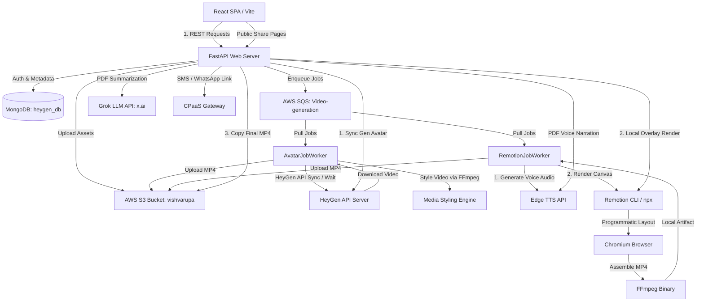

# Technical Architecture & System Deep-Dive: Personalized Video & Talking PDF Platform

This document provides a highly detailed, comprehensive architectural breakdown of the **Personalized Video Generator & Talking PDF Platform**. It serves as an authoritative guide to the codebase, design systems, workflows, data schemas, and pipeline mechanics.

---

## 1. High-Level Architecture & System Topology

The platform is divided into three primary physical layers:
1. **Frontend (Vite + React + TailwindCSS):** A modern interactive single-page application (SPA) providing campaign wizards, video libraries, a template manager, and a Talking PDF summarizer.
2. **Backend (FastAPI + Python 3.11):** An asynchronous REST API orchestrating auth, data storage, external service connections, media post-processing, and worker queues.
3. **Remotion Engine (Node.js + React):** A browser-based programmatic video rendering pipeline, packaged alongside the backend, that leverages Chromium and FFmpeg to build frame-accurate, personalized dynamic videos.

Below is a diagram of the end-to-end system topology, describing the communication between components:



---

## 2. Database Schema & Collections

The application relies on MongoDB (`heygen_db`) managed via the asynchronous `motor` driver. The data access layer is strongly typed on the Python side using **Pydantic v2**. 

### 2.1 Collection Registry
The primary collections inside MongoDB are:
*   `users`: Stores credentialed profiles, auth status, and admin flags.
*   `videos`: Acts as a unified task and catalog collection for all generated videos (HeyGen and Remotion).
*   `drafts`: Holds autosaved templates and unfinished campaign payloads.
*   `custom_avatars`: Stores curated overrides for HeyGen avatar profiles.
*   `whatsapp_templates`: Holds pre-defined message and script templates for borrower outreach campaigns.
*   `pdf_summaries` (aliased as `pdf_collection` in code): Houses records for parsed PDFs, summaries, custom audio links, and borrowing entities.
*   `whatsapp_logs`: Tracks dispatched CPaaS notifications and delivery receipts.

### 2.2 Core Data Models (Pydantic Representations)

#### `User` / `UserInDB`
Used to manage authentication, account status, and role-based permissions (JWT HS256-based).
| Field | Type | Description |
| :--- | :--- | :--- |
| `_id` | `ObjectId` | Auto-generated MongoDB primary key |
| `username` | `str \| None` | User handle (optional) |
| `email` | `EmailStr` | Primary identifier for credentials; must be unique |
| `full_name` | `str \| None` | Profile name |
| `disabled` | `bool \| None` | Account status flag |
| `is_admin` | `bool` | Grants access to administrative views (default: `False`) |
| `hashed_password`| `str` | Stored inside `UserInDB`; salted bcrypt hash |

#### `VideoRecord` / `VideoJobResult`
Tracks the lifecycle of a video generation task across both HeyGen and Remotion flows.
| Field | Type | Description |
| :--- | :--- | :--- |
| `user_id` | `str` | Foreign key referencing `User` email or unique identifier |
| `status` | `str` | Current state machine status: `queued`, `processing`, `completed`, `failed` |
| `title` | `str \| None` | User-friendly label (e.g. "Loan Recall - Rahul Kumar - LAN12345") |
| `video_url` | `str \| None` | S3 remote storage URL (signed dynamically on retrieval) |
| `request_mode` | `str` | Generation pipeline mode: `direct`, `template`, `remotion`, `avatar_async` |
| `created_at` | `datetime` | India Standard Time (IST) timestamp, naive-stored to avoid MongoDB conversions |
| `job_data` | `dict \| None` | Raw payload containing input arguments (`request_payload`) and vendor responses |

#### `PDFRecord`
The primary record schema backing the **Talking PDF** document parsing flow.
| Field | Type | Description |
| :--- | :--- | :--- |
| `user_id` | `str` | Creator identifier |
| `phone_number` | `str \| None` | Borrower's mobile number for WhatsApp notification campaigns |
| `language` | `str \| None` | The language of the document summary/narration (default: `Hindi`) |
| `status` | `str` | Lifecycle status: `pending`, `downloading`, `processing`, `summarizing`, `completed`, `failed` |
| `filename` | `str \| None` | Uploaded document filename |
| `pdf_url` | `str \| None` | S3 URL pointing to the original uploaded PDF |
| `original_text` | `str \| None` | Full text payload extracted by `pypdf` |
| `summary_text` | `str \| None` | Curated narrative summary generated by Grok |
| `audio_url` | `str \| None` | S3 path to Edge-TTS summary mp3 |
| `next_actions_text`| `str \| None` | Custom action plans editable before audio compilation |
| `next_actions_audio_url` | `str \| None` | S3 path to Edge-TTS next-actions mp3 |
| `created_at` / `updated_at` | `datetime` | Standard tracking timestamps (IST) |

---

## 3. HeyGen Avatar Video Pipeline

This pipeline generates highly realistic synthetic videos where an AI avatar reads out a dynamically rendered legal notice or status summary.

### 3.1 Synthesis Orchestration
The system supports two HeyGen integration mechanisms, managed by `app/services/video_service.py`:
1.  **Direct Synthesis (`generate_direct`):** Creates an avatar composition from scratch. The backend builds a multi-layered JSON request containing the avatar style, background color, dimensions, and text narration. It calls HeyGen's `/v2/video/generate` REST endpoint.
2.  **Template-based Synthesis (`generate_from_template`):** Binds variables to a pre-built HeyGen template. It reads a base template file (e.g. `sample_data/template_payload.json`), performs inline string replacement for bracketed context variables (e.g. `{{ customer_name }}`), and submits it to HeyGen's `/v2/template/{template_id}/generate` endpoint.

```
[UI Wizard Request]
        │
        ▼
[FastAPI Route: /generate/direct]
        │
        ├─► 1. Jinja2: Render script template with borrower details
        ├─► 2. Voice Resolution: Find exact matching active voice or select fallback
        ├─► 3. MongoDB: Write VideoRecord document (status = "queued")
        ├─► 4. SQS Service: Submit video _id to AWS SQS queue
        ▼
[SQS Queue (Async Processing)]
        │
        ▼
[AvatarJobWorker]
        │
        ├─► 1. Mark VideoRecord as "processing"
        ├─► 2. HTTP POST to HeyGen API (submit synthesis job)
        ├─► 3. Poll HeyGen /v1/video_status.get until "completed" (or timeout)
        ├─► 4. Download source MP4 locally
        ├─► 5. Execute MediaStylingService: Burn overlays (subtitles/logos) via FFmpeg
        ├─► 6. S3 Service: Upload finalized MP4 to "vishvarupa" bucket
        ├─► 7. MongoDB: Update VideoRecord to "completed" with the S3 URL
        └─► 8. SQS Service: Delete SQS message
```

### 3.2 Indian Avatar & Voice Localization Architecture
Because the native HeyGen catalog contains globally diverse, sometimes unsuited avatar styles and voices, the system implements two layers of standard overrides:

1.  **Avatar Overrides:**
    *   The `custom_avatars` collection stores localized overrides.
    *   Avatars are assigned traditional Indian names (e.g., Mahesh, Rahul, Priya, Adv. Aditi Mehra, Advocate Dev Kumar) to match the Indian user demographic.
    *   When listing avatars (`GET /meta/avatars`), any non-Indian model has its name programmatically remapped to standard Indian display names via a hash-matching algorithm (e.g., Aarohi, Ananya, Naina, Samar, Varun, Sanjay) based on gender.
    *   To keep a professional appearance, "unprofessional" tags (e.g., *casual, t-shirt, outdoor, sport*) are filtered out of the API responses. Only suit-and-blazer models are displayed in the UI.

2.  **Voice Resolution & Failovers:**
    *   Before submitting a synthesis request, `_resolve_voice_id()` compares the requested voice against the real-time active HeyGen voice catalog.
    *   If a selected voice is unavailable or missing due to provider-side licensing updates, the system matches it with a compatible same-gender fallback voice to prevent the synthesis run from crashing.
    *   If HeyGen throws a `MOVIO_PAYMENT_INSUFFICIENT_CREDIT` or a `voice is not available` error during API submission, the backend parses the response and returns a user-friendly error message rather than a raw stack trace.

---

## 4. Remotion Text-To-Video Rendering Pipeline

The local text-to-video rendering pipeline acts as a programmatic video creation engine. Instead of generating an avatar, it uses React to create rich dynamic visual slides, overlaying them with Azure-backed Edge-TTS audio.

### 4.1 End-to-End Processing Flow

```
[REST Route: /generate/remotion]
        │
        ▼
[1. Script Compilation]
   Render Jinja2 script using RemotionVideoRequest context parameters.
   If Hindi is selected, normalize English numerals to Devanagari names.
        │
        ▼
[2. Microsoft Edge-TTS Narration]
   Execute edge-tts command line to generate:
   - Voice audio file: Remotion/public/audio/{video_id}.mp3
   - SRT/VTT subtitle file: Remotion/public/assets/{video_id}.vtt
        │
        ▼
[3. SRT/VTT Subtitle Parsing]
   Regex extracts timestamps: start_seconds, end_seconds, and text.
   Normalize Milliseconds (supporting both comma and decimal formats).
        │
        ▼
[4. Scene Payload Compilation]
   Assemble the scene payload. Define text highlights, screen layouts, 
   branding tokens (colors/logo), and subtitles.
   Write the payload to Remotion/leads.json.
        │
        ▼
[5. Subprocess Compilation]
   Invoke Remotion CLI via:
   npx --yes remotion render src/index.jsx main <output_path> --props=<props_path>
        │
        ▼
[6. Local Compilation & Verification]
   Chromium renders the composition frames and compiles them into H.264 MP4.
   Upload the MP4 to S3, clean up local temporary props files, and return the S3 URL.
```

### 4.2 Timeline Generation & Animation Speed Mechanics
Because dynamic scripts vary in length, the system cannot use static compositions. It calculates frame timings dynamically:
*   **FPS (Frames Per Second):** Hardcoded to `30`.
*   **Total Duration:** Retrieved by inspecting the MP3 audio file metadata using `mutagen.mp3.MP3`.
*   **Total Frames:** `duration_seconds * FPS`.
*   **Dynamic Scene Ratios:** `getSceneTimeline()` in `Remotion/src/videoData.js` splits the total frames across 6 scenes proportionally. It distributes frames based on relative scene weight and copy density.

```
Total Frames (e.g. 900 frames for 30s video)
  ├─► Scene 0 (Opening Card)    ── Weight: 1.0  ──  150 Frames
  ├─► Scene 1 (Account details) ── Weight: 1.0  ──  150 Frames
  ├─► Scene 2 (Overdue Context) ── Weight: 1.0  ──  150 Frames
  ├─► Scene 3 (Amount Summary)  ── Weight: 1.0  ──  150 Frames
  ├─► Scene 4 (Immediate Step)  ── Weight: 1.0  ──  150 Frames
  └─► Scene 5 (Closing Card)    ── Weight: 1.0  ──  150 Frames
```

### 4.3 Structured Layout Templates
The Remotion engine supports three core layouts:

#### A. Account Notice (`account_notice`):
*   **Aesthetics:** High-contrast dark-mode (`#020817`), floating geometric background orbs, breathing pulse dots, and a bottom progress tracker.
*   **Scenes:**
    1.  *Opening:* Large "Formal Notice" alert card with the borrower's name.
    2.  *Account:* Highlights the Loan Account Number (LAN) and product type.
    3.  *Context:* Displays the outstanding balance with red urgency indicators.
    4.  *Financials:* A breakdown of the principal amount and overdue interest.
    5.  *Action:* Next-steps screen highlighting the lender's contact information.
    6.  *Closing:* Resolution warning advising immediate contact to avoid legal escalation.

#### B. Payment Guidance (`payment_guidance`):
*   **Aesthetics:** High-trust light-mode (`#f8fafc`), clean layouts, TVS Credit/PhonePe branding, and a purple accent color.
*   **Scenes:**
    1.  *PaymentWelcomeScene:* Displays the borrower's name and agreement details.
    2.  *PaymentChecklistScene:* Lists the payment checklist (open link, verify LAN, enter payable amount).
    3.  *PaymentPhoneScene (Walkthrough 1):* Split layout. The left panel shows the checklist instructions, while the right panel displays a mock phone screen.
    4.  *PaymentSafetyScene:* Summarizes details for borrower review before confirmation.
    5.  *PaymentPhoneScene (Walkthrough 2):* Repeats the phone screen walkthrough to reinforce the payment steps.
    6.  *PaymentSupportScene:* Deep purple closing card with a call-support pill.

#### C. Vertical Payment Guidance (`payment_link_guidance`):
*   **Aesthetics:** Vertical composition (`1080x1920` - 9:16 aspect ratio), optimized for viewing on mobile screens and sharing via WhatsApp.
*   **Walkthrough Screen Config:** Driven by a weighted step configuration array (`PHONE_STEP_CONFIG`):

```javascript
export const PHONE_STEP_CONFIG = [
  { img: 'step1.png', tap: { x: 231, y: 362 }, weight: 1.0 }, // Open PhonePe and tap "Loan Repayment"
  { img: 'step2.png', tap: { x: 110, y: 111 }, weight: 1.2 }, // Search and tap "TVS Credit"
  { img: 'step3.png', tap: null,               weight: 2.4 }, // Typing LAN (tap disabled, keyboard visible)
  { img: 'step3.png', tap: null,               weight: 1.6 }  // Reviewing amount (same screen, narration active)
];
```

*   **Weighted Progression:** The animation advances through the steps using cumulative weight ratios rather than uniform interpolation. This allows the system to hold steps 2 and 3 longer, giving the TTS engine enough time to read the LAN digits and outstanding balances.
*   **Tap Coordinates:** Derived from display dimensions using a scale-down mapping: `x_display = x_source * 0.368`, `y_display = (y_source * 0.368) - 43` (accounting for image cropping). Steps with a `null` tap configuration do not render the pulsing tap indicator.

---

## 5. Hybrid Avatar PIP Pipeline

The **Hybrid Avatar PIP (Picture-in-Picture)** engine is a dual-stage video generation system. It combines the highly realistic talking human-like avatars of HeyGen with local React-based layouts rendered programmatically via the Remotion engine. 

Instead of showing a standalone talking avatar or rendering a pure text-to-video slide system, it creates a visual interface where a customized collections avatar reads out a localized legal notice, rendered as a PIP video embedded dynamically in the bottom-right corner of a stylized dashboard.

The end-to-end synthesis and render orchestration flow is handled by `app/services/hybrid_remotion_avatar_pip_service.py` and triggered via `POST /generate/hybrid-remotion-avatar-pip`:

### 5.1 Phase 1: Raw HeyGen Avatar Generation (`generate_raw_avatar_for_hybrid`)
1. **Dynamic Script Construction:** The service constructs a personalized collections outreach script based on the client, customer details, and selected locale. 
   * **Hindi Script Template:** 
     `"नमस्ते {customer_name} जी। मैं {agent_name}, कलेक्शंस टीम से बोल रही हूँ। आपके खाते {account_number} पर भुगतान {days_overdue} दिनों से लंबित है। कुल देय राशि {amount_due} है। कृपया आज ही भुगतान करें या सहायता के लिए हमारी टीम से संपर्क करें।"`
   * **English Script Template:** 
     `"Hello {customer_name}. I am {agent_name} from the collections team. Your account {account_number} has been overdue for {days_overdue} days. The amount due is {amount_due}. Please complete the payment today or contact our team for assistance."`
2. **Synchronous Synthesis Request:** Rather than queuing the job via workers, the route executes `VideoService().generate_direct` in a synchronous wait state (`wait=True`). The raw request is submitted to HeyGen's `/v2/video/generate` with specific visual constraints:
   * `include_captions=False` (captions are not burned into the raw video)
   * `background_color="#F4F4F4"` (off-white backdrop to facilitate subsequent chroma/overlay alignment)
   * `video_width=720` and `video_height=1280` (portrait frame layout)
3. **Local Storage & Duration Probing:** Once synthesis finishes, the backend downloads the raw MP4 file locally and runs `ffprobe` to determine its precise duration in seconds (`duration_seconds`). It converts this duration to absolute frame boundaries at 30 FPS (`ceil(duration_seconds * 30)`).

### 5.2 Phase 2: Local PIP Remotion Render (`render_hybrid_avatar_pip_video`)
1. **Staging Intermediate Asset:** The staged raw HeyGen avatar video is copied directly to the local Remotion project at `Remotion/public/avatar/{video_id}.mp4` so that the React environment can access the media stream in real time.
2. **Aspect Ratio & Composition Resolution:** The backend resolves the aspect ratio mode dynamically:
   * **Landscape Mode:** Resolves to `landscape_16_9` if the request selects landscape or `auto` mode where the viewport aspect is landscape (`viewport_width >= viewport_height`). This routes the render to the `HybridCollectionNoticeLandscape` composition (1920x1080).
   * **Portrait Mode:** Resolves to `portrait_9_16` (default/mobile-first layout). This routes the render to the `HybridCollectionNoticePortrait` composition (1080x1920).
3. **JSON Props Trigger & Subprocess Compile:** The service writes the collection parameters to a temporary JSON configuration file (`hybrid_props_*.json`) inside the `Remotion/` directory. It then spawns a local subprocess running:
   ```bash
   npx --yes remotion render src/index.jsx [CompositionName] [OutputPath] --props=[PropsFilePath] --overwrite
   ```
4. **Final Packaging:** Remotion uses a headless Chromium browser to render the canvas layout frame-by-frame, embed the MP4 avatar video inside a Picture-in-Picture window, and multiplex the audio stream. The final MP4 is copied to the static directory `/tmp/hybrid-public` and served via `/generated/{video_id}.mp4`. A corresponding document is saved to the `videos` collection with `request_mode` set to `"hybrid_remotion_avatar_pip"`.

### 5.3 Staging Layouts & Aesthetics (React UI components)
The Remotion UI elements are structured to deliver premium aesthetics utilizing high-fidelity visual cards and smooth layout transitions:
* **Landscape Layout (`LandscapeCollectionUI`):** Serves wide-screen layouts with a two-column setup. The left column presents outstanding loan details, payment progress bars, lender brands, and support cards. The right column showcases the Picture-in-Picture talking avatar.
* **Portrait Layout (`MobileCollectionUI`):** Optimized for vertical mobile viewports. Features a premium red header bar (`#c91428`), clear structured balance cards, a circular progress tracker showing the current status percentage, and an action-oriented call support button.
* **`<AvatarPip>` Component:** Wraps the HeyGen MP4 stream as a floating rounded card, complete with a dark translucent backdrop, a subtle drop shadow, and floating labels for the Agent's Name and Title.
  * **Landscape PIP Offsets:** Width `480px`, Height `680px`, positioned at `right: 100px`, `bottom: 120px`.
  * **Portrait PIP Offsets:** Width `360px`, Height `560px`, positioned at `right: 54px`, `bottom: 220px`.

---

## 6. Media Post-Processing & Styling Engine (FFmpeg & Pillow)

While Remotion generates subtitles inside React, the HeyGen pipeline requires subtitles to be baked directly into the video file after synthesis. The backend's `MediaStylingService` accomplishes this via a custom-engineered Python post-processing engine.

```
                       [HeyGen Raw Video]
                               │
                               ▼
            [Step 1: Check Video Geometry via FFprobe]
            Determine width, height, and precise duration.
                               │
                               ▼
            [Step 2: Parse WebVTT & Build Cues]
            Download subtitle track and extract time ranges.
            If missing, segment transcript into 10-word chunks.
                               │
                               ▼
            [Step 3: Pillow Overlay Compilation]
            For each cue:
            - Wrap text to fit width (max 78% of video canvas).
            - Compute dynamic text boundaries (textbbox).
            - Draw dark background card (RGBA 12, 10, 24, 132).
            - Overlay colored text with stroke shadow.
            - Save frame as transparent overlay PNG.
                               │
                               ▼
            [Step 4: Cascade FFmpeg Overlay Filter]
            Map each PNG image input using a timed delay cascade:
            [0:v][1:v]overlay=enable='between(t,start,end)'[v1]...
                               │
                               ▼
            [Step 5: Apply Logo Watermark Filter]
            Scale logo to standard width (scale=220:-2).
            Adjust opacity and map it to a corner coordinate.
                               │
                               ▼
            [Step 6: H.264 Transcoding & Compilation]
            Execute FFmpeg: libx264, yuv420p, faststart.
```

### 6.1 Subtitle Canvas Overlays via Pillow
To ensure Devanagari and regional Indic fonts render correctly across operating systems, the styling service resolves font paths dynamically. It checks a prioritized list of system fonts (e.g. `Devanagari Sangam MN.ttc`, `Nirmala.ttf`, `Mangal.ttf`) or falls back to a custom configuration path.

The system renders subtitles using **Pillow (PIL)**:
1.  **Text Wrapping:** The service wraps the narrative text based on the target font size (e.g. `width * 0.034`) to ensure it does not overflow the video screen.
2.  **Background Card:** It draws a dark, rounded rectangle with a slight transparency (`RGBA 12, 10, 24, 132`) behind the text to make it easily readable on any video background.
3.  **Indic Subtitles:** Subtitles are aligned horizontally and vertically using configurable margin properties (`top`, `center`, `bottom`). Text strokes are applied using a dark border shadow to improve contrast.

### 6.2 Dynamic FFmpeg Overlay Cascade
Instead of running multiple FFmpeg processes (which degrades video quality through repeated compression), the service compiles all operations into a single **filter complex** command.

A typical command generated for a three-cue subtitle video with a logo watermark looks like this:

```bash
ffmpeg -y -i source.mp4 \
  -loop 1 -i captions/cue_000.png \
  -loop 1 -i captions/cue_001.png \
  -loop 1 -i captions/cue_002.png \
  -i styling/logo.png \
  -filter_complex \
  "[0:v]format=rgba[base]; \
   [base][1:v]overlay=0:0:enable='between(t,0.00,3.40)'[sub1]; \
   [sub1][2:v]overlay=0:0:enable='between(t,3.40,7.10)'[sub2]; \
   [sub2][3:v]overlay=0:0:enable='between(t,7.10,11.50)'[sub3]; \
   [4:v]scale=220:-2,format=rgba,colorchannelmixer=aa=0.80[logo]; \
   [sub3][logo]overlay=main_w-overlay_w-32:32[styled]" \
  -map "[styled]" -map 0:a? \
  -c:v libx264 -preset medium -crf 23 -pix_fmt yuv420p -c:a aac -movflags +faststart final.mp4
```

*   **Format Conversion:** `[0:v]format=rgba[base]` converts the source video stream to support alpha channels.
*   **Cascade Mapping:** Each PNG cue is overlaid onto the output stream of the previous cue. The `enable='between(t,...)'` filter ensures that each cue overlay is shown only within its active time window.
*   **Logo Overlay:** The logo image input is scaled to `220px` wide, blended to `80%` opacity using `colorchannelmixer`, and placed at a specified coordinate (e.g. top right: `main_w-overlay_w-32:32`).
*   **Audio Mapping:** `-map 0:a?` copies the original audio track if present.
*   **Streaming Optimization:** `-movflags +faststart` shifts the video metadata index (moov atom) to the beginning of the file. This allows browsers to start playing the video immediately before it is fully downloaded.

---

## 7. The "Talking PDF" Workflow

The **Talking PDF** feature summarizes complex document payloads (such as loan agreements, arbitration notices, and financial summaries) and narrates them to borrowers in their preferred language.

```
                      [User Uploads PDF]
                              │
                              ▼
                [1. In-Memory Extraction]
                Download PDF/read bytes. Use pypdf to 
                extract clean plain text payload.
                              │
                              ▼
                [2. Grok Summarization Model]
                Format prompt template with target language.
                Call Grok: grok-4-1-fast-reasoning.
                Generate audio-ready translation script.
                              │
                              ▼
                [3. Edge-TTS Audio Generation]
                Use edge_tts Python API to synthesize voice.
                Store MP3 locally. Limit concurrency to 1.
                              │
                              ▼
                [4. AWS S3 Upload & Cleanup]
                Upload original PDF and MP3 to S3.
                Delete local temporary MP3 file.
                              │
                              ▼
                [5. WhatsApp Outreach & Share Link]
                Save PDFRecord to MongoDB.
                Deliver public share URL (/s/<pdfId>) via WhatsApp.
```

### 7.1 Summarization Engine (Grok Model Integration)
The system uses the **Grok** API (`grok-4-1-fast-reasoning`) to summarize documents. Grok is instructed to act as a legal and financial narrator.

It uses an external prompt template (`app/prompts/summarization_prompt.txt`) that accepts the document text and target language parameters:
*   The prompt instructs the model to translate complex terms into clear, action-oriented regional phrases.
*   The output format is structured to clearly present the **Outstanding Balance**, **Loan Account Number**, **Lender Name**, and **Action Steps**.
*   The model also outputs an editable `next_actions_text` block. This allows collections agents to customize follow-up instructions before regenerating the final audio files.

### 7.2 Concurrent Request Control (Rate Limiting)
To prevent concurrent requests from hammering the Edge-TTS engine and causing socket disconnects or IP bans, `app/services/audio_service.py` implements a **concurrency semaphore**:
*   An `asyncio.Semaphore(1)` acts as a rate limiter.
*   Only one audio synthesis task can run at a time; all other requests are queued.
*   Once synthesis is complete, files are uploaded to S3, and local copies are deleted immediately to free up disk space.

### 7.3 Public Share Page & WhatsApp Campaign Delivery
*   **Public Share Page (`/s/<pdfId>`):** A borrower-facing interface that loads the PDF summary. Borrowers can view the document and play the generated narration audio files side-by-side.
*   **Bulk Campaign Routing:** Agents can upload a CSV containing borrower details: `phone_number`, `pdf_link`, and `language`. The backend processes each CSV row: it extracts the PDF text, generates the summary and audio files, saves the record, and sends a WhatsApp message with the share link using the `wsp_test2` template.

---

## 8. Infrastructure, Deployment, & CI/CD Setup

The system is containerized using Docker and is deployed in a cloud environment (e.g., AWS EC2).

### 8.1 Containerization (Multi-Container Setup)
The platform uses two Docker images defined in the project root:

```
                          ┌──────────────────────────┐
                          │    docker-compose.yml    │
                          └────────────┬─────────────┘
                                       │
                ┌──────────────────────┴──────────────────────┐
                ▼                                             ▼
  ┌──────────────────────────┐                  ┌──────────────────────────┐
  │  personalized-backend   │                  │  personalized-frontend   │
  ├──────────────────────────┤                  ├──────────────────────────┤
  │ - Python 3.11 Runtime    │                  │ - Nginx Web Server       │
  │ - FFmpeg Library         │                  │ - Pre-compiled React     │
  │ - Node.js & npm (Remotion)│                 │ - Reverse Proxy /api     │
  │ - Chromium Browser       │                  │ - Static asset server    │
  │ - Indic Fonts Support    │                  │                          │
  └──────────────────────────┘                  └──────────────────────────┘
```

#### Backend Image Configuration (`Dockerfile`):
*   Uses a Python 3.11 base image.
*   Installs system dependencies: `ffmpeg`, Node.js (v20), and npm.
*   Installs Chromium (`chromium-browser`) to run Remotion's browser-based canvas rendering.
*   Configures open-source Noto fonts (e.g. `fonts-noto-core`, `fonts-noto-ui-devanagari`) to support Hindi and other Indic scripts in Remotion video renders.
*   Exposes port `8000`.

#### Frontend Image Configuration (`Frontend/Dockerfile`):
*   Uses a multi-stage build. First, it compiles the React assets using Node.js.
*   Then, it copies the compiled assets to a lightweight Nginx web server.
*   Nginx is configured (`nginx.conf.template`) to serve static assets and reverse-proxy any API requests (`/api`) to the backend container origin.
*   Exposes port `80` (mapped to port `8080` in compose files).

### 8.2 Continuous Integration & Continuous Delivery (CI/CD)
The project includes two GitHub Actions workflows located in `.github/workflows/`:

1.  **Continuous Integration (`ci.yml`):**
    *   Runs on every pull request or push.
    *   Sets up Python, runs backend tests (`pytest`), runs frontend linters, and checks that Remotion npm dependencies install successfully.
2.  **Continuous Delivery (`publish-images.yml`):**
    *   Runs on manual trigger or when code is merged into the release branch.
    *   Builds the backend and frontend Docker images and pushes them to the GitHub Container Registry (GHCR).
    *   Connects to the target EC2 server via SSH using secrets (`EC2_SSH_KEY`, `EC2_HOST`, `EC2_USERNAME`).
    *   Uploads the updated `docker-compose.ec2.yml` configuration file.
    *   Pulls the updated Docker images from GHCR and restarts the container services.

---

## 9. Summary of Platform Differences

The platform includes three distinct video generation engines. The following table summarizes the differences between the **HeyGen Avatar**, **Remotion Text-to-Video**, and **Hybrid Avatar PIP** engines:

| Characteristic | HeyGen Avatar Engine | Remotion Text-To-Video Engine | Hybrid Avatar PIP Engine |
| :--- | :--- | :--- | :--- |
| **Primary Use Case** | Highly realistic legal notice or greeting narration by a synthetic human avatar. | Programmatic payment guidance videos and step-by-step app walkthroughs. | Merged high-realism avatar narration with local structural dashboards (collection cards). |
| **Aesthetics** | Video of a speaking avatar framed against solid colors or templates. | Clean, dynamic slide transitions, animated UI panels, and mock app screen interactions. | Floating, round-cornered PIP avatar video card overlaid on dynamic visual metrics. |
| **Processing Location** | Offloaded to HeyGen's API servers. | Rendered locally on the backend server using Node.js, Chromium, and FFmpeg. | Dual-stage: HeyGen raw synthesis offloaded; composite PIP overlay rendered locally. |
| **Voice Synthesis** | Native HeyGen text-to-speech voices. | Local Microsoft Edge-TTS API (`edge-tts`). | Native HeyGen text-to-speech voices (local staging). |
| **Subtitling Mechanics** | Handled by `MediaStylingService`. Burned into the video using PIL and FFmpeg overlay cascades. | Built directly into the React/Remotion canvas. Timed dynamically using VTT files. | Subtitles managed inside the React/Remotion canvas or standard templates. |
| **Typical Rendering Time** | ~3 to 8 minutes (subject to external API queues). | ~30 seconds to 2 minutes (subject to script length and server CPU cores). | ~4 to 10 minutes (subject to raw HeyGen API queues + 1 min local Chromium compile). |
| **Cost Profile** | High (incurs HeyGen credit costs per generation). | Low (free, limited only by the host server's CPU and memory resources). | Medium-High (incurs HeyGen credit costs for the raw avatar synthesis segment). |

---

## 10. Recommendations & Architectural Improvements

To improve the platform's reliability and scalability, the following improvements are recommended:

1.  **Separate the Remotion Worker:** Currently, both the `AvatarJobWorker` and `RemotionJobWorker` run on the main FastAPI backend server. Heavy Remotion video rendering tasks (`npx remotion render`) use significant CPU resources. These workers should be separated from the web server and run on auto-scaling GPU or high-vCPU worker instances (such as AWS ECS or AWS Batch).
2.  **Refactor Subtitle Copy (Single Source of Truth):** In the Remotion pipeline, the translated text scripts used for voice synthesis live in the database and frontend templates, while the localized UI subtitles are stored inside `TemplateVideo.jsx` (`PAYMENT_COPY`). These subtitle blocks should be unified into a single database template collection to make it easier to manage translations.
3.  **Implement Asset Cleanup Policies:** Video generation creates large temporary files (VTT subtitles, MP3 voice recordings, PNG overlays, and draft videos) inside the `Remotion/public/audio/` and `/tmp` directories. An automated cleanup cron job should be added to delete temporary assets older than 24 hours to prevent the server from running out of disk space.
4.  **Add Real-Time Progress Updates:** Currently, the frontend gets progress updates by polling the `/videos/{id}/status` endpoint. Integrating **WebSockets** or Server-Sent Events (SSE) would provide real-time progress updates, improving the user experience during video generation.
